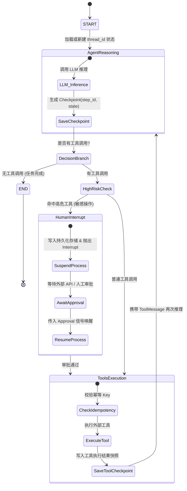

# 生产级智能体断点恢复（Checkpoint & Resumption）设计与实施方案

## 一、 为什么需要断点恢复？

在生产环境中，大模型智能体（Agent）通常执行多步推理，频繁调用外部 API，或需要等待外部异步信号（如人工审批 HITL、Webhook 回调）。如果系统状态仅保存在单机内存中，会面临以下严重痛点：

1. **系统可用性脆弱（无容灾能力）**：服务部署发版、Pod 重启、超时崩溃会导致执行到一半的任务完全丢失。
2. **Token 与算力成本浪费**：任务一旦中断，必须从第一步重新调用大模型与外部工具，重复产生高额 Token 消耗。
3. **外部副作用与非幂等风险**：某些工具（如发邮件、扣款、调用下游写接口）已成功执行，从头重跑可能导致业务重复操作。
4. **无法支持长周期事务（Long-running Workflows）**：等待人工审核可能耗时数小时甚至数天，不能长期占用工作线程与内存。

通过**断点恢复（Checkpoint & Resumption）**机制，系统在每个执行超步（Superstep）自动对当前状态进行持久化快照，实现“崩溃可续跑、高危可挂起、历史可回溯”。

---

## 二、 核心架构设计

### 2.1 状态与检查点执行图


### 2.2 核心核心要素说明

| 核心组件 | 职责与技术实现 |
| :--- | :--- |
| **Thread ID（任务唯一会话标识）** | 每一个任务分配全局唯一的 `thread_id`，作为持久化存储的主键/分区隔离键。 |
| **Checkpoint 快照** | 记录当前图的状态（包含 `values` 历史消息与上下文变量、`next` 待执行的下一个节点、`metadata` 步骤与时间戳）。 |
| **Checkpointer 持久化适配器** | 实现 `BaseCheckpointSaver` 接口（如 PostgreSQL、SQLite、Redis），接管状态的序列化与存取。 |
| **中断与唤醒（Interrupt & Resume）** | 敏感节点通过 `interrupt()` 挂起并释放线程；外部通过传入 `resume` 信号从检查点无缝恢复。 |
| **幂等性与时间旅行（Time-Travel）** | 支持从任意历史检查点回溯查看状态，或基于历史快照分叉重试。 |

---

## 三、 LangGraph 原生支持与架构映射

LangGraph 将整个执行引擎抽象为事件驱动的状态机（State Machine），原生内置 Checkpoint 支持：

1. **会话隔离**：
   通过配置字典传入标识：
   ```python
   config = {"configurable": {"thread_id": "session_order_1001"}}
   ```
2. **持久化绑定**：
   ```python
   # 绑定持久化存储引擎
   app = workflow.compile(checkpointer=checkpointer)
   ```
3. **人工审批与长事务挂起（HITL）**：
   使用 LangGraph 原生 `interrupt()` 与 `Command(resume=...)` 机制：
   ```python
   from langgraph.types import interrupt, Command

   def approval_node(state):
       # 抛出中断，状态落库并释放计算资源
       decision = interrupt({"action": "refund", "amount": 500})
       return {"approval_result": decision}

   # 唤醒续跑
   app.invoke(Command(resume={"approved": True}), config=config)
   ```

---

## 四、 具体实施路线图

### 阶段一：持久化存储层落地
- **存储介质选型**：
  - 本地/单机验证：基于 SQLite 的持久化 Checkpointer（`.db` 文件）。
  - 生产集群部署：基于 PostgreSQL 的分布式 Checkpointer（支持高并发读写锁与连接池）。
- **数据表结构**：
  - `checkpoints`：保存 `thread_id`、`checkpoint_ns`、`checkpoint_id`、`parent_checkpoint_id`、`type`、序列化后的状态字节流。
  - `checkpoint_writes`：保存超步中各节点的写入增量。

### 阶段二：支持断点恢复的智能体工作流开发
1. **工作流改造**：
   - 提取 `agent_manual.py` 中的原生打点与 ReAct 逻辑。
   - 引入 Checkpoint 状态图，将状态编译绑定至 SQLite/Postgres Checkpointer。
2. **敏感操作审批拦截**：
   - 增加高危工具（如系统配置修改、数据库写入操作）。
   - 配置前置审核或在工具节点前设置 `interrupt`。
3. **接口封装**：
   - `start_task(thread_id, query)`：初次发起长任务。
   - `resume_task(thread_id, resume_data)`：断点续跑任务。
   - `get_task_history(thread_id)`：查看各步检查点快照。

### 阶段三：生产灾难与容灾演练测试
建立自动化测试套件，模拟以下三种典型生产场景：

1. **场景 1：进程崩溃冷重启断点续跑**
   - 运行多步任务，在第 1 步工具执行完毕后模拟系统崩溃退出（强制终止进程）。
   - 重启新进程，传入相同 `thread_id`，验证智能体直接从第 2 步继续执行，不重复调用第 1 步工具。
2. **场景 2：长周期人工审批挂起与唤醒（HITL）**
   - 任务触发高危操作并挂起中断。
   - 检查数据库确认任务已落盘挂起。
   - 模拟审批人员在 Web 后台点击“通过”，调用恢复接口完成后续任务。
3. **场景 3：时间旅行回溯与状态分叉（Time-Travel）**
   - 读取任务在第 2 步的 Checkpoint 快照。
   - 修改上下文参数，从该历史状态发起分支执行，用于线上排障与回滚。

---

## 五、 生产级注意事项与防坑指南

1. **分布式并发锁（Distributed Lock）**：
   在多 Pod 集群部署中，必须对同一个 `thread_id` 加分布式锁（如基于 Redis Redlock 或 PostgreSQL 行锁），防止多个 Worker 同时 resume 导致状态分支冲突。
2. **状态契约版本迁移（Schema Evolution）**：
   Checkpoint 序列化存储了 `AgentState`。当迭代增加或修改字段时，需要设置默认值或版本迁移器，避免老快照反序列化崩溃。
3. **存储容量与 TTL 清理策略**：
   高频任务下 Checkpoint 数据量增长迅速。生产环境应对已完结的任务设置生命周期（如保留 30 天），过期数据定期归档至冷存储并清理主库。
4. **工具幂等性防护（Idempotency Guard）**：
   必须为每个外部写操作生成唯一的 `idempotency_key`，防止网络抖动导致的重复提交。
